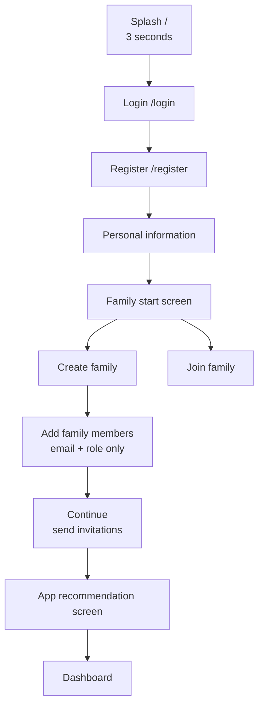
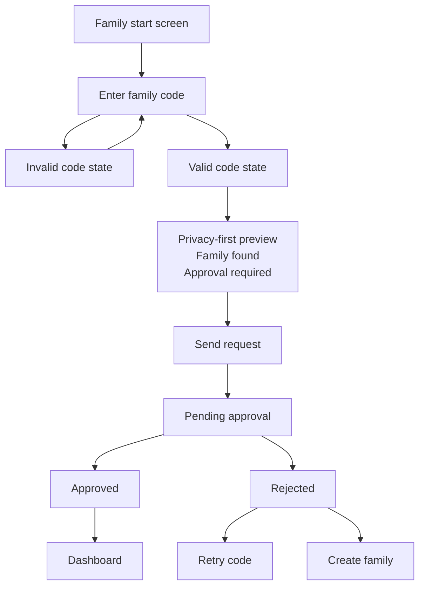
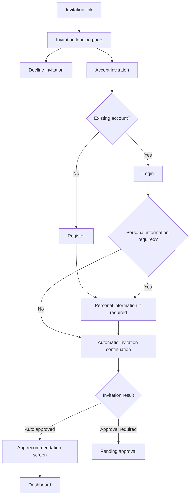
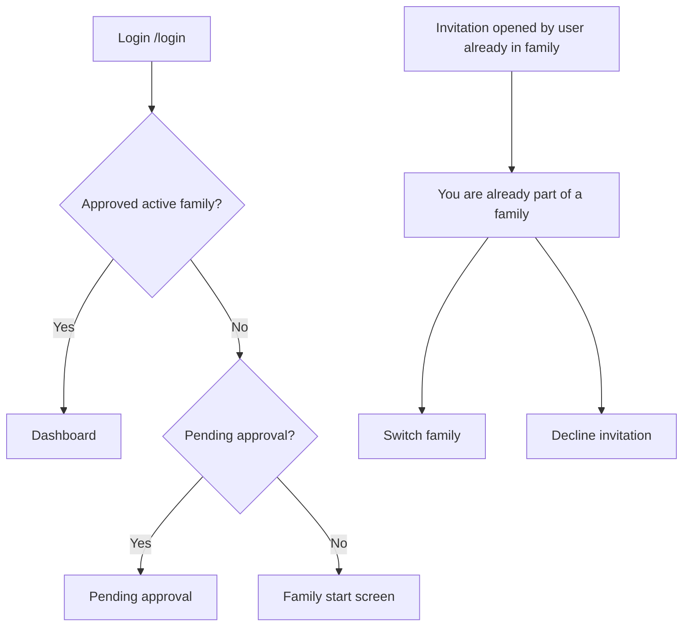

# FamilieAppen Onboarding Flow

## Goal

This document is the source of truth for the approved pre-dashboard onboarding flow in FamilieAppen. It defines the state machine from splash screen until the user is allowed to access the family dashboard.

Onboarding exists to handle:

- Account creation.
- Personal profile completion.
- Family creation.
- Family joining.
- Invitation handling.
- Approval handling.
- The transition from onboarding into the dashboard.

A user may only leave onboarding and enter dashboard functionality after the account belongs to an approved family.

## Global principles

- Dashboard functionality is **not** available until the user belongs to an approved family.
- Users waiting for family approval have limited access only.
- Family data is privacy-first throughout onboarding.
- A family code must not expose sensitive family details.
- The splash screen redirects to login.
- App suggestion happens **after** the invitation/account flow is completed.
- Onboarding is mobile-first.
- The experience should feel calm, simple and low friction.

## Route/state overview

The onboarding state machine begins at the splash screen and ends when the user has an approved family membership and can access the dashboard.

### Splash

Route: `/`

- Duration: 3 seconds.
- After 3 seconds, redirect to `/login`.
- No dashboard functionality is available from the splash screen.

Next:

- `/login`.

### Login

Route: `/login`

The login screen handles authentication for existing users and provides entry points for account recovery and registration.

States:

- Successful login with approved family membership → dashboard.
- Successful login without family membership → family start screen.
- Successful login with pending family approval → pending approval screen.
- Forgot password → forgot password flow.
- Register → `/register`.

### Register

Route: `/register`

Required fields:

- Email.
- Password.
- Confirm password.
- Terms/privacy acceptance.

Terms/privacy acceptance is required before continuing.

Next:

- Personal information.

### Personal Information

The personal information step completes the user's basic profile before family selection or invitation continuation.

Required fields:

- First name.
- Last name.
- Phone number.
- Birth date.

Optional fields:

- Profile image.

Next:

- Family selection, when the user is registering without an active invitation context.
- Invitation continuation, when the user came from an invitation and authentication/profile completion is now finished.

### Family Start Screen

The family start screen is shown when an authenticated user has no active approved family membership and is not continuing an invitation flow.

The user chooses one of two actions:

1. Create family.
2. Join family.

### Create Family Flow

The create family flow lets a user create a new family and invite initial family members.

Approved behavior:

- The user creates the family.
- The family creator becomes an administrator.
- The creator can add family members during setup.
- Added family members require email + role only.
- Added family members do **not** require a name.
- Invitations are only sent after the creator selects **Continue**.
- Family code copy/share is supported.

Supported roles:

- Administrator.
- Guardian/Foresatt.
- Child/Barn.

Next:

- App recommendation screen.
- Dashboard.

### Join Family via Family Code

The family code flow lets a user request access to an existing family.

Approved behavior:

- User enters a family code.
- Invalid code state is shown when the code cannot be found or cannot be used.
- Valid code state is shown when the family code is recognized.
- The valid code state uses a privacy-first family preview.

The privacy-first family preview must **not** expose:

- Family members.
- Children.
- Family name.
- Administrator identity.

The privacy-first family preview may only show:

- "Family found".
- Approval required.

Next:

- Send request.
- Pending approval.

### Invitation Link Flow

The invitation link flow is used when a user opens a family invitation link.

Approved behavior:

- Invitation landing page is shown first.
- User may accept or decline the invitation.
- Existing account users log in.
- Users without an account register.
- Personal information is collected if required.
- After authentication and required profile completion, the invitation flow continues automatically.

Cases:

- Auto approved → app recommendation screen → dashboard.
- Approval required → pending approval.

### App Recommendation Screen

Route: `/onboarding/app-recommendation`

The app recommendation screen is the final onboarding step before dashboard access. It encourages users to download the native app while still allowing them to continue in the browser.

Required actions:

- App Store link.
- Google Play link.
- Continue in browser.

Next:

- Continue in browser → dashboard.
- Approved invitation/account/family creation flows must pass through this screen before dashboard.

### Pending Approval State

The pending approval state is shown when a user has requested access to a family but has not yet been approved.

Allowed while pending:

- Profile.
- Create family.
- Join family.
- Logout.

Blocked while pending:

- Shopping lists.
- Calendar.
- Tasks.

Banner text:

> Request sent to family

Approval result:

- Approved → app recommendation screen → dashboard.
- Rejected → retry code or create family.

### Existing User Invited While Already in Family

MVP decision: one active family per account.

When an existing user who already belongs to an active family opens an invitation, show:

> You are already part of a family

Options:

- Switch family.
- Decline invitation.

Switching family is an explicit user choice. Dashboard access remains tied to the active approved family.

## Flow diagrams

### 1. Normal registration flow

### 2. Family code flow

### 3. Invitation link flow

### 4. Existing user flow

## Onboarding assumptions documented

- The dashboard is only reachable for users with an approved active family membership.
- A pending request does not grant access to family productivity features.
- Pending users may still manage their profile, create a family, join another family or log out.
- Family code lookup confirms that a family exists and approval is required, but does not reveal identifying family data.
- Invitation links preserve context through login, registration and personal information completion.
- App recommendation is intentionally placed after account/invitation completion and before dashboard access.
- MVP supports one active family per account.
- A user who is already in a family must explicitly switch family or decline a new invitation.
